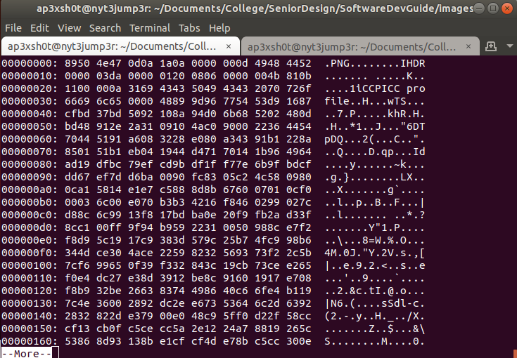
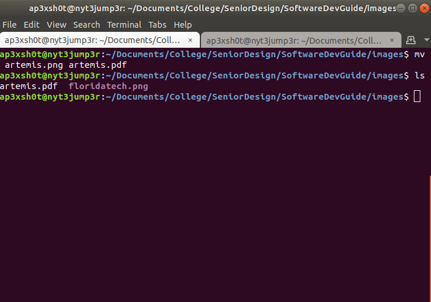
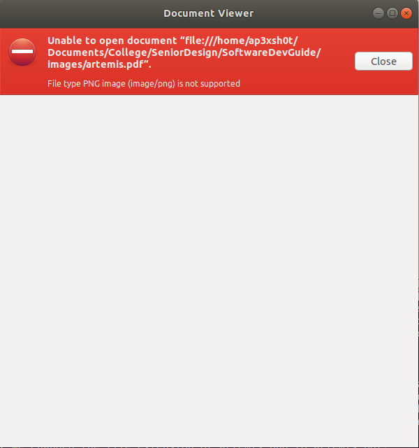
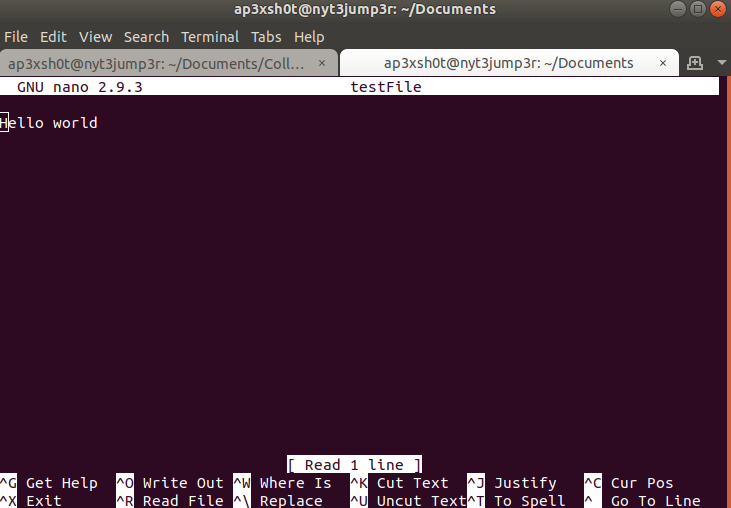
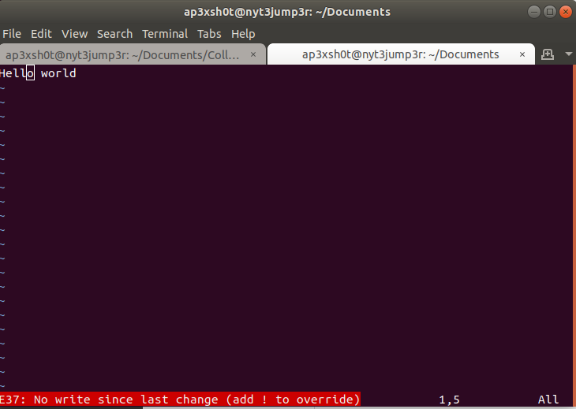
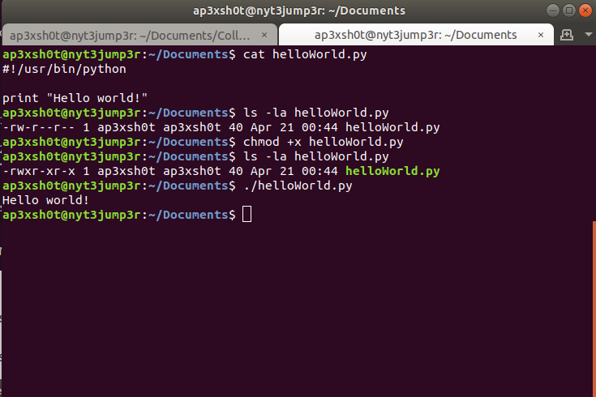
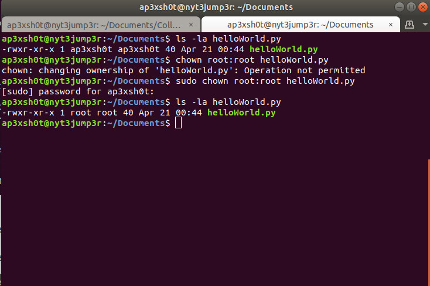
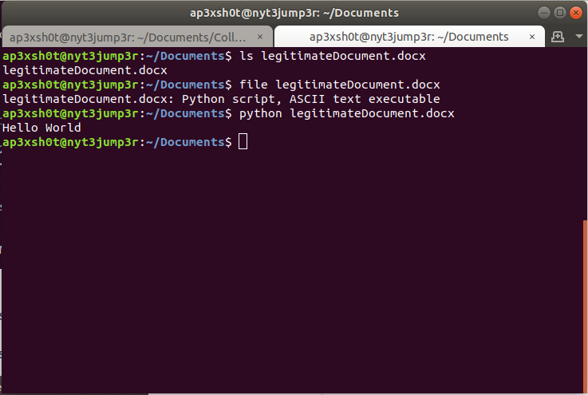

Section 5: System Commands
=====

## Content

### [Subsection 0: Files](#files)
> Brief description of the system commands
### [Subsection 1: File Commands](#file-commands)
> List of all of the system commands in this guide
### [Subsection 2: File Exercises](#file-exercises)
> Exercises to hone your skills

### Files

In Linux, files are a bit different from those in Windows. First, file extensions are not really standardized. File type comes from file header bytes most commonly referred to as "magic bytes". Below is a hex dump of the Artemis png at the top of this page.

The first four bytes of the image show as 8950 4e47, which as we can see to the right are the hexidecimal characters for the PNG "magic bytes". All files in Linux have something similar to this if the file is not saw ASCII encoded (human readable) format. So why am I mentioning all of this? Well, as new Linux users its important for you to know that file extensions can lie to you in Linux. For example consider what would happen if we changed the file extension of artemis.png to artemis.pdf?

Now what if we try to open it like its a PDF document?

As we can see, just because a file has an extension doesnt mean it actually is.

#### File Commands
Below are some of the more common commands that are used for handling files

* [touch](#touch)		- Create a new empty file
* [mv](#mv)			- Move a file
* [Text Editors](#editors)	- Command line text editors
	* [Vim](#vim)
	* [Nano](#nano)
* [chmod](#chmod)		- Change file permissions
* [chown](#chown)		- Change file ownership
* [rm](#rm)			- Remove a file
* [cp](#cp)			- Copy a file
* [file](#file)			- Display file information

#### touch
Touch is a great way to create an empty file quickly. For instance, GitHub does not allow you to have empty directories, so while making this guide, I used touch to create all the README markdown files so that the directory structure would be in place even if there was no content. You should really only use touch when you need to create a placeholder file that you aren't going to edit immediately. If you're going to add content to the file immefiately, you should use one of the editors below as it will create the file whenever you use it.

> touch filename

#### mv
The move utility is incredibly useful if not for its ability to move things, but also to rename them. The best way to remember which operand goes where with move is to think in terms of "command source destination". This is almost always true of most unix commands.

> mv file/source/path file/destination/path

Or you can use move to rename files like such:

> mv fileName newFileName

#### editors
There are many command line text editors available, but the two most popular are vim and nano, and let me tell you; both have cult-like following from their users. Most people like nano better because its a bit easier to use. I prefer vim because I enjoy the punishment. Vim is a bit more versatile, but nano is more beginner friendly.

> ##### Nano
> Nano is one of the simplest command line text editors available. It lists key bindings on the bottom to make it easy for the user to save and exit the file
>
> 

> ##### Vim
> Vim is a little more difficult to use, but it is more powerful. If you're not going too wild, it may be worth sticking to nano. When you create or modify a file using vim you need to place vim into "insert" mode before you're able to change or add text. To do this, press 'i'. In the lower left side of the terminal it should say "Insert". Once you are done editing, you need to press the escape button on your keyboard to exit out of insert mode. To save and exit, you need to press the colon key, plus the commands to write and quit. It looks like this:
>
> :wq
>
> The 'w' is for write, and the 'q' is for quit. But what if you made a change to the file and DONT want to save it? You may get a message like this:
>
> 
>
> To exit without saving, you need to use the ! operator like such:
>
> :q!
>
> Additionally, you can copy and cut things easily with vim. To highlight, press 'v'. To highlight an entire line, press shift + 'v'. To copy a line, press 'y'. To cut, press 'd'. And finally, to paste, you press 'p'.

#### chmod
The chmod command is very useful when creating executable binaries and scripts. You will need to change the permission of the file to make it executable. Below is an example of a python script being given executable permissions.

In the image above, a simple python script that prints "Hello World!" was created. We looked at the permssions of the file before chmod is used. We see that there are no x's in the permissions. After we chmod +x the file we can see there are x's present in the permissions. The +x gives everyone on the machine the ability to execute the script. If you would like to restrict the execution of a script or binary to just your user, you would use chmod u+x.

#### chown
The chown utility is useful for changing ownership. You may need to change ownership of files at some point to satisfy some program requirement. In the image below we change the ownership of the helloWorld.py script from the example above.

In the image above, we list the details of the python script we want to change ownership on. We attempt to chown the file, but find that we need elevated privileges to do so. Using sudo to elevate our privileges temporarily to root, we can then chown the file. The operand 'root:root' is changing the owner AND the group in which the file belongs.

#### rm
The remove utility is helpful for cleaning up old files. Its a very simple command to use.

> rm filename

The rm utility doesn't work on directories since we have rmdir. Or does it? Remember when I mentioned that rmdir doesn't work on directories that arent empty? Well rm can be used to remove directories that have other files in them. We just need to use the '-r' flag. The '-r' flag is a recursive remove. This remove goes into the directory, and into any further nested directories, and removes files starting at the lowest level and working its way back up until it removes the directory you pointed it at.

You can also remove protected files using the '-f' flag, or final flag. We are getting into some dangerous territory though. What happens if you elevate privileges AND remove recursively some important directory? You can potentially make the operating system unusable with a command like that. So **PLEASE** do be careful with using recursive removes with sudo.

#### cp
The copy utility is very similar to the move, except instead of simply moving, it makes a copy. Mind blowing stuff, I know. Again, this follows the "command source destination" structure.

> cp /path/to/source /path/to/destination

#### file
The file utility allows us to check what a file actually is from the command line. Remember when I told you not to trust file extensions? This is our way of checking what a file really is.

As we can see by the example above, file helps us identify what the file is, even if it is acting like a Microsoft Word document.

#### File Exercises
Whew! I know this is a lot of information, but I know you're more than capable of getting this stuff down. Plus, you can brag to your friends about your new hacker skills.

* Create a new file inside of the NASA_ROBOTICS directory named "failure.py"
* Edit the file to inslude the following text:
	> #!/usr/bin/python 
	> print "It's not an option"
* Make the script executable
* Run the script
	* ./failure.py
* Copy the script to your home directory
* Rename the script in the NASA_ROBOTICS directory to "failure.pdf"
* Navigate to your home directory
* Remove the NASA_ROBOTICS directory and all of its contents recursively.

#### What you should have learned:

* ***How to create new files***
* ***How to move and rename files***
* ***How to remove files***
* ***How to identify file types***
* ***How to change permission and ownership of files***

