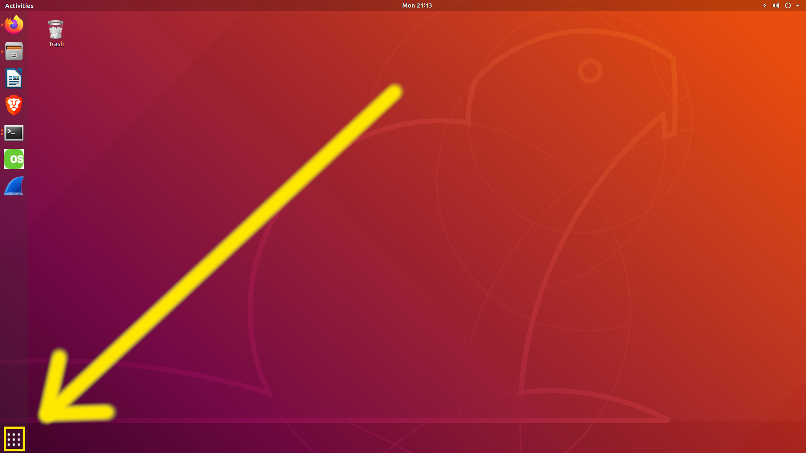
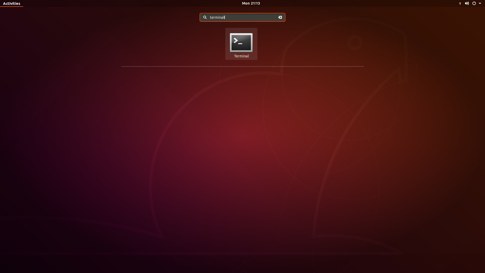
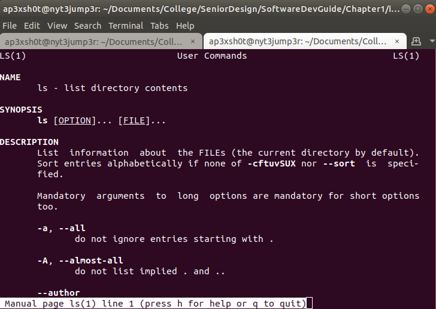
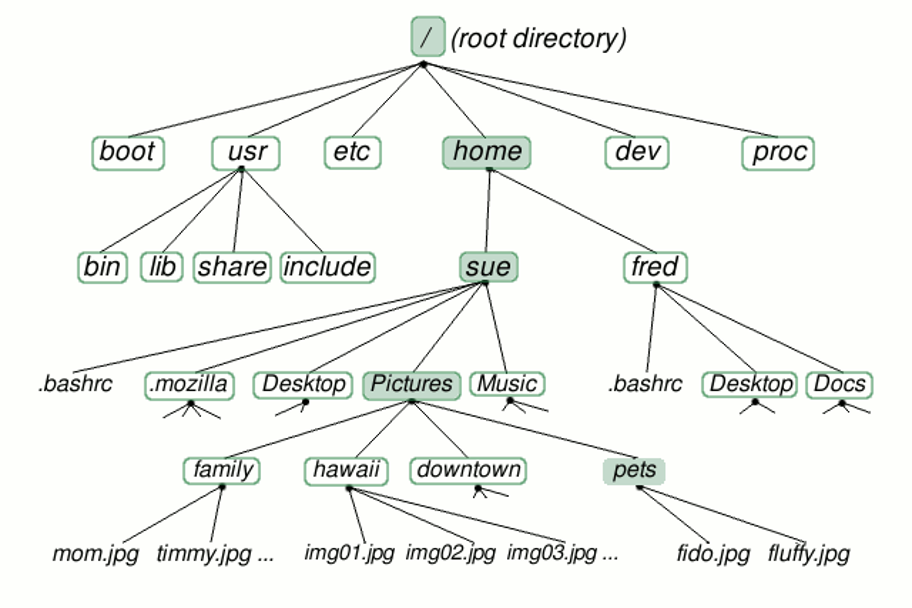

Chapter 1: Basic Linux
=====

## Content

### [Section 0: Why Command Line?](#why-command-line)
> Why you should use the command line over the graphical user interface
### [Section 1: Command Resources](#command-resources)
> How to find more information on commands
### [Section 2: Directories](#directories)
> Commands dedicated to working with directories
### [Section 3: Files](#files)
> Commands dedicated to working with files
### [Section 4: Text](#text)
> Commands dedicated to working with text
### [Section 5: System](#system)
> Commands dedicated to working with the system

## Excercises
### [Exercise 0: Directory Exercises](#directory-exercises)
### [Exercise 1: File Exercises](#file-exercises)
### [Exercise 2: Text Exercises](#text-exercises)
### [Exercise 3: System Exercises](#system-exercises)
-----

### Why Command Line?

Linux command line interface is very powerful. It seems complicated, but once you get used to it, it can open a world of possibilities that normally would take much longer to complete. Additionally, the command line is the easiest way to interract with a Linux system when it comes to software development.

To open a terminal, the program we use to interact with the command line, we click the dots at the bottom of the screen, and type "terminal".

-----

### Command Resources

There are many terminal commands, and each command has its own subset of special use cases. How can we possibly know all of the special commands to use? This is where man pages come in. Man pages are the manual on how to use a specific command. Additionally, some commands may have a "-h", or "--help" flag that helps us to figure out what kinds of input the command can handle.

### Directories

In linux, much like Windows, directories are nested in a tree structure.

All directories stem from the root directory, also known as "/". 
Every user on the system has a home directory in /home, also known as "~". 
Anytime you are using a terminal, the current directory you are in is aliased as ".",
and the parent directory (the directory directly above your current directory) is "..".

#### Directory Commands:
Below are some of the most common commands for working with directories.

* [ls](#ls)		- lists the contents of a directory
* [cd](#cd)		- change directory
* [pwd](#pwd)		- print working directory
* [mkdir](#mkdir)	- make directory
* [rmdir](#rmdir)	- remove directory

#### ls
The list command prints all of the contents of the directory specified. If you type just "ls", the contents of the directory in which you currently reside are returned. If you specify a directory path, you can list contents in a directory you are not currently residing in. Additionally, there are options that you can use with ls to print additional information about each file in a directory. Here are some of the most common:

* ls -l		- list long; provide size, ownership, and creation date time stamp
* -a 		- list all; print all file and directories, including hidden

#### cd
The cd command is useful for changing your current working dirctory. This command is pretty simple. There are some options for cd, but they aren't used very often. One thing that I'd like to mention here is there are two different ways to look at paths that you could cd to: absolute paths, and relative paths.

* Absolute Paths	- Full path name from root. i.e. /home/nasauser/Documents/filename.txt
* Relative Paths	- Can be referenced with path shortcuts such as ".." or "~". i.e. ~/Documents/filename.txt

#### pwd
The print working diretory is a command that rarely gets used, but can be useful if you need to know exactly where in a directory tree you are located. Typically in Ubuntu the path is included next to the terminal where you type. If you end up using sh instead of bash as your shell, you will need pwd to know where you are.

#### mkdir

The make directory command is useful for just what it sounds like. Whenever you need a new directory, you can use mkdir followed by the directory name or path to the location you wish to create the new directory.

#### rmdir

Remove directory is fairly simple as well, but it is important to note that rmdir will only work on empty directories. If you have files inside of a directory and want to remove all of them at the same time, there is a command that I will share with you further down the page.

#### Directory Exercises

Great! You've make it this far. How is your transition from a world of Windows to the hacker-esque world of Linux terminal treating you thus far? Please follow these exercises. They may seem trivial, but when you're trying to get work done you're not going to want to come back here to look up how to create a directory and potentially lose your train of thought!

* Create a directory inside of your home directory called "NASA_ROBOTICS" (mkdir)
* Change directories into the NASA_ROBOTICS directory (cd)
* Make another directory named "scripts" (mkdir)
* Verify that you are in /home/username/NASA_ROBOTICS
* Change back to your home directory (cd)
* Attempt to remove the NASA_ROBOTICS directory (rmdir)
	* Note: This should fail as the directory is not empty
* List all the contents of the NASA_ROBOTICS directory without changing directories
* Remove the NASA_ROBOTICS/scripts directory
	* Note: You should only be removing the scripts directory, not NASA_ROBOTICS
* List the contents of NASA_ROBOTICS to confirm scripts was removed

#### What you should have learned:
* ***How to create and remove directories***
* ***How to change directories***
* ***How to find which directory you are currently in***
* ***How to list the contents of a directory***

### Files

### Text

### System

