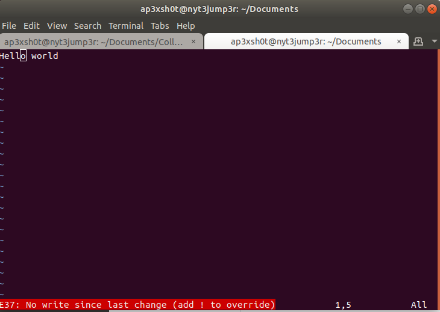
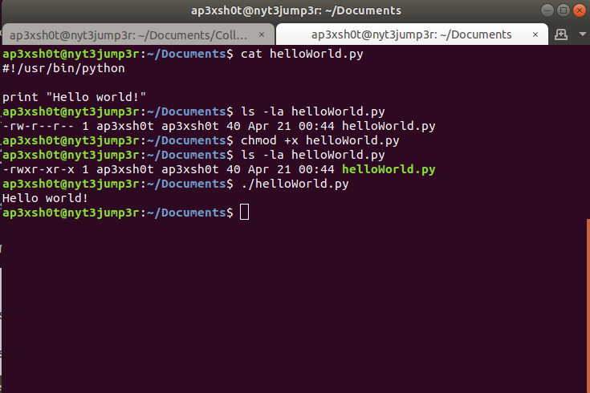

Chapter 1: Basic Linux
=====

## Content

### [Section 0: Why Command Line?](#why-command-line)
> Why you should use the command line over the graphical user interface
### [Section 1: Command Resources](#command-resources)
> How to find more information on commands
### [Section 2: Directories](#directories)
> Commands dedicated to working with directories
### [Section 3: Files](#files)
> Commands dedicated to working with files
### [Section 4: Text](#text)
> Commands dedicated to working with text
### [Section 5: System](SYSTEM.md)
> Commands dedicated to working with the system

## Excercises
### [Exercise 0: Directory Exercises](#directory-exercises)
### [Exercise 1: File Exercises](#file-exercises)
### [Exercise 2: Text Exercises](#text-exercises)
### [Exercise 3: System Exercises](#system-exercises)
-----

### Why Command Line?

Linux command line interface is very powerful. It seems complicated, but once you get used to it, it can open a world of possibilities that normally would take much longer to complete. Additionally, the command line is the easiest way to interract with a Linux system when it comes to software development.

To open a terminal, the program we use to interact with the command line, we click the dots at the bottom of the screen, and type "terminal".

-----

### Command Resources

There are many terminal commands, and each command has its own subset of special use cases. How can we possibly know all of the special commands to use? This is where man pages come in. Man pages are the manual on how to use a specific command. Additionally, some commands may have a "-h", or "--help" flag that helps us to figure out what kinds of input the command can handle.

### Directories

In linux, much like Windows, directories are nested in a tree structure.

All directories stem from the root directory, also known as "/". 
Every user on the system has a home directory in /home, also known as "~". 
Anytime you are using a terminal, the current directory you are in is aliased as ".",
and the parent directory (the directory directly above your current directory) is "..".

#### Directory Commands:
Below are some of the most common commands for working with directories.

* [ls](#ls)		- lists the contents of a directory
* [cd](#cd)		- change directory
* [pwd](#pwd)		- print working directory
* [mkdir](#mkdir)	- make directory
* [rmdir](#rmdir)	- remove directory

#### ls
The list command prints all of the contents of the directory specified. If you type just "ls", the contents of the directory in which you currently reside are returned. If you specify a directory path, you can list contents in a directory you are not currently residing in. Additionally, there are options that you can use with ls to print additional information about each file in a directory. Here are some of the most common:

* ls -l		- list long; provide size, ownership, and creation date time stamp
* -a 		- list all; print all file and directories, including hidden

#### cd
The cd command is useful for changing your current working dirctory. This command is pretty simple. There are some options for cd, but they aren't used very often. One thing that I'd like to mention here is there are two different ways to look at paths that you could cd to: absolute paths, and relative paths.

* Absolute Paths	- Full path name from root. i.e. /home/nasauser/Documents/filename.txt
* Relative Paths	- Can be referenced with path shortcuts such as ".." or "~". i.e. ~/Documents/filename.txt

#### pwd
The print working diretory is a command that rarely gets used, but can be useful if you need to know exactly where in a directory tree you are located. Typically in Ubuntu the path is included next to the terminal where you type. If you end up using sh instead of bash as your shell, you will need pwd to know where you are.

#### mkdir

The make directory command is useful for just what it sounds like. Whenever you need a new directory, you can use mkdir followed by the directory name or path to the location you wish to create the new directory.

#### rmdir

Remove directory is fairly simple as well, but it is important to note that rmdir will only work on empty directories. If you have files inside of a directory and want to remove all of them at the same time, there is a command that I will share with you further down the page.

#### Directory Exercises

Great! You've make it this far. How is your transition from a world of Windows to the hacker-esque world of Linux terminal treating you thus far? Please follow these exercises. They may seem trivial, but when you're trying to get work done you're not going to want to come back here to look up how to create a directory and potentially lose your train of thought!

 * Create a directory inside of your home directory called "NASA_ROBOTICS" (mkdir)
 * Change directories into the NASA_ROBOTICS directory (cd)
 * Make another directory named "scripts" (mkdir)
 * Verify that you are in /home/username/NASA_ROBOTICS
 * Change back to your home directory (cd)
 * Attempt to remove the NASA_ROBOTICS directory (rmdir)
 	* Note: This should fail as the directory is not empty
 * List all the contents of the NASA_ROBOTICS directory without changing directories
 * Remove the NASA_ROBOTICS/scripts directory
 	* Note: You should only be removing the scripts directory, not NASA_ROBOTICS
 * List the contents of NASA_ROBOTICS to confirm scripts was removed

#### What you should have learned:
* ***How to create and remove directories***
* ***How to change directories***
* ***How to find which directory you are currently in***
* ***How to list the contents of a directory***

### Files

In Linux, files are a bit different from those in Windows. First, file extensions are not really standardized. File type comes from file header bytes most commonly referred to as "magic bytes". Below is a hex dump of the Artemis png at the top of this page.

The first four bytes of the image show as 8950 4e47, which as we can see to the right are the hexidecimal characters for the PNG "magic bytes". All files in Linux have something similar to this if the file is not saw ASCII encoded (human readable) format. So why am I mentioning all of this? Well, as new Linux users its important for you to know that file extensions can lie to you in Linux. For example consider what would happen if we changed the file extension of artemis.png to artemis.pdf?

Now what if we try to open it like its a PDF document?

As we can see, just because a file has an extension doesnt mean it actually is.

#### File Commands
Below are some of the more common commands that are used for handling files

* [touch](#touch)		- Create a new empty file
* [mv](#mv)			- Move a file
* [Text Editors](#editors)	- Command line text editors
	* [Vim](#vim)
	* [Nano](#nano)
* [chmod](#chmod)		- Change file permissions
* [chown](#chown)		- Change file ownership
* [rm](#rm)			- Remove a file
* [cp](#cp)			- Copy a file
* [file](#file)			- Display file information

#### touch
Touch is a great way to create an empty file quickly. For instance, GitHub does not allow you to have empty directories, so while making this guide, I used touch to create all the README markdown files so that the directory structure would be in place even if there was no content. You should really only use touch when you need to create a placeholder file that you aren't going to edit immediately. If you're going to add content to the file immefiately, you should use one of the editors below as it will create the file whenever you use it.

> touch filename

#### mv
The move utility is incredibly useful if not for its ability to move things, but also to rename them. The best way to remember which operand goes where with move is to think in terms of "command source destination". This is almost always true of most unix commands.

> mv file/source/path file/destination/path

Or you can use move to rename files like such:

> mv fileName newFileName

#### editors
There are many command line text editors available, but the two most popular are vim and nano, and let me tell you; both have cult-like following from their users. Most people like nano better because its a bit easier to use. I prefer vim because I enjoy the punishment. Vim is a bit more versatile, but nano is more beginner friendly.

> ##### Nano
> Nano is one of the simplest command line text editors available. It lists key bindings on the bottom to make it easy for the user to save and exit the file
>
> 

> ##### Vim
> Vim is a little more difficult to use, but it is more powerful. If you're not going too wild, it may be worth sticking to nano. When you create or modify a file using vim you need to place vim into "insert" mode before you're able to change or add text. To do this, press 'i'. In the lower left side of the terminal it should say "Insert". Once you are done editing, you need to press the escape button on your keyboard to exit out of insert mode. To save and exit, you need to press the colon key, plus the commands to write and quit. It looks like this:
>
> :wq
>
> The 'w' is for write, and the 'q' is for quit. But what if you made a change to the file and DONT want to save it? You may get a message like this:
>
> 
>
> To exit without saving, you need to use the ! operator like such:
>
> :q!
>
> Additionally, you can copy and cut things easily with vim. To highlight, press 'v'. To highlight an entire line, press shift + 'v'. To copy a line, press 'y'. To cut, press 'd'. And finally, to paste, you press 'p'.

#### chmod
The chmod command is very useful when creating executable binaries and scripts. You will need to change the permission of the file to make it executable. Below is an example of a python script being given executable permissions.

In the image above, a simple python script that prints "Hello World!" was created. We looked at the permssions of the file before chmod is used. We see that there are no x's in the permissions. After we chmod +x the file we can see there are x's present in the permissions. The +x gives everyone on the machine the ability to execute the script. If you would like to restrict the execution of a script or binary to just your user, you would use chmod u+x.

#### chown
The chown utility is useful for changing ownership. You may need to change ownership of files at some point to satisfy some program requirement. In the image below we change the ownership of the helloWorld.py script from the example above.

In the image above, we list the details of the python script we want to change ownership on. We attempt to chown the file, but find that we need elevated privileges to do so. Using sudo to elevate our privileges temporarily to root, we can then chown the file. The operand 'root:root' is changing the owner AND the group in which the file belongs.

#### rm
The remove utility is helpful for cleaning up old files. Its a very simple command to use.

> rm filename

The rm utility doesn't work on directories since we have rmdir. Or does it? Remember when I mentioned that rmdir doesn't work on directories that arent empty? Well rm can be used to remove directories that have other files in them. We just need to use the '-r' flag. The '-r' flag is a recursive remove. This remove goes into the directory, and into any further nested directories, and removes files starting at the lowest level and working its way back up until it removes the directory you pointed it at.

You can also remove protected files using the '-f' flag, or final flag. We are getting into some dangerous territory though. What happens if you elevate privileges AND remove recursively some important directory? You can potentially make the operating system unusable with a command like that. So **PLEASE** do be careful with using recursive removes with sudo.

#### cp
The copy utility is very similar to the move, except instead of simply moving, it makes a copy. Mind blowing stuff, I know. Again, this follows the "command source destination" structure.

> cp /path/to/source /path/to/destination

#### file
The file utility allows us to check what a file actually is from the command line. Remember when I told you not to trust file extensions? This is our way of checking what a file really is.

As we can see by the example above, file helps us identify what the file is, even if it is acting like a Microsoft Word document.

#### File Exercises
Whew! I know this is a lot of information, but I know you're more than capable of getting this stuff down. Plus, you can brag to your friends about your new hacker skills.

* Create a new file inside of the NASA_ROBOTICS directory named "failure.py"
* Edit the file to inslude the following text:
	> #!/usr/bin/python 
	> print "It's not an option"
* Make the script executable
* Run the script
	* ./failure.py
* Copy the script to your home directory
* Rename the script in the NASA_ROBOTICS directory to "failure.pdf"
* Navigate to your home directory
* Remove the NASA_ROBOTICS directory and all of its contents recursively.

#### What you should have learned:

* ***How to create new files***
* ***How to move and rename files***
* ***How to remove files***
* ***How to identify file types***
* ***How to change permission and ownership of files***

### Text
There are ways to filter and redirect text input and output to programs in Linux that might come in handy for your project. These commands are very powerful and allow for some really cool ways to slice data.

#### Text Commands

* [cat](#cat)					- Print contents of a file
* [Pipe Operator](#pipe-operator)		- Redirect output as input
* [Redirection Operator](#redirection-operator)	- Redirects output to a filestream
* [grep](#grep)					- Search text by pattern
* [cut](#cut)					- Cut text by a delimiter

#### cat
The cat utility is useful for printing the contents of a file. Sometimes a file will contain binary data which contains information that isn't human readable. You're still able to cat these files, but it will come out as jumbled garbage. The reason I bring this up is because while you're able to cat all files, many you really shouldn't need to.

#### Pipe Operator
The pipe operator "|" is very useful because it takes the output of some operation and uses it as the input for another operation. A good example of how the pipe operator works is below in the grep section.

#### Redirection Operator
The redirection operator ">" is useful for taking the output of an operation and write it to a file. Say you'd like to write a copy of a ping command. Ping is a network connectivity testing utility, but thats not important.

As you can see, the output generated by ping was redirected into a file that we can now print the contents out anytime we would like without having to rerun the utility.

#### grep
Grep is a very useful utility for searching large text outputs for specific patterns. Many times you may have too much output, which makes it difficult to find what you're looking for. Here is an example of using grep to eliminate unwanted output.

Imagine you are trying to find your IP address. Using iconfig to find our IP address looks like this:

As you can see ifconfig outputs a lot of undesirable information. If we pipe this output to grep and look for "192" we can eliminate all lines that doesn't contain this first octet of the IP address. It is important to note that "192" should be replaced with the first octet of the network you are on. Panthair issues IP addresses in the 169 range, so you should grep for 169.

#### cut
Sometimes you might grep for specific lines, but you want to write data to a file that excludes some information contained in that line. Lets use the ifconfig example to isolate our IP address and write it to a file.

First, we run the ifconfig utility and grep for "192"

> ifconfig | grep 192

Next, we figure out what delimiter we can cut by. If we use space, we can separate the different words in the line. Its worth noting that the output contains many spaces before the word "inet", so the field we want to select will not be what we originally think. The cut syntax goes like this:

> cut -d " " -f n; where " " is a delimiter of space and n is the field number

As it turns out, if we pipe the output of our grep to cut using a delimiter of space, the field we need to look at to isolate our IP address is field 10. The command looks like this:

> ifconfig | grep 192 | cut -d " " -f 10

Now, if we want to write the IP address to a file, we can use the redirection operator to a file.

> ifconfig | grep 192 | cut -d " " -f 10

#### Text Exercises
* Edit the script in your home directory to print another line
	* The script should look like:
	> #!/usr/bin/python
	> print "It's not an option"
	> print "NASA Robotics is awesome!"
	* Run the script to make sure it works
* Now run the script, but use pipe and grep to print only the line that contains "NASA"
* Next, use cut to islate the word "NASA"
* Redirect the output to a file called "NASA.training"
* Print the contents of "NASA.training" to the screen

#### What you should have learned:

* ***How to print the contents of a file***
* ***How to redirect output***
* ***How to isolate information in large outputs***

