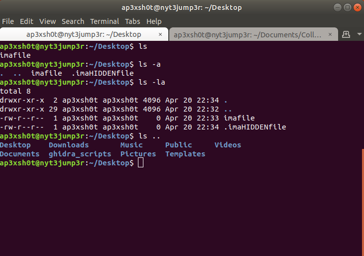

Chapter 1: Basic Linux
=====

## Content

### [Section 0: Why Command Line?](#why-command-line)
> Why you should use the command line over the graphical user interface
### [Section 1: Command Resources](#command-resources)
> How to find more information on commands
### [Section 2: Directories](#directories)
> Commands dedicated to working with directories
### [Section 3: Files](#files)
> Commands dedicated to working with files
### [Section 4: Text](#text)
> Commands dedicated to working with text
### [Section 5: System](#system)
> Commands dedicated to working with the system

-----

### Why Command Line?

Linux command line interface is very powerful. It seems complicated, but once you get used to it, it can open a world of possibilities that normally would take much longer to complete. Additionally, the command line is the easiest way to interract with a Linux system when it comes to software development.

To open a terminal, the program we use to interact with the command line, we click the dots at the bottom of the screen, and type "terminal".

-----

### Command Resources

There are many terminal commands, and each command has its own subset of special use cases. How can we possibly know all of the special commands to use? This is where man pages come in. Man pages are the manual on how to use a specific command. Additionally, some commands may have a "-h", or "--help" flag that helps us to figure out what kinds of input the command can handle.

### Directories

In linux, much like Windows, directories are nested in a tree structure.

All directories stem from the root directory, also known as "/". 
Every user on the system has a home directory in /home, also known as "~". 
Anytime you are using a terminal, the current directory you are in is aliased as ".",
and the parent directory (the directory directly above your current directory) is "..".

#### Directory Commands:
Below are some of the most common commands for working with directories.

* ls	- lists the contents of a directory
* cd	- change directory
* pwd	- print working directory
* mkdir	- make directory
* rmdir	- remove directory

#### ls
The list command prints all of the contents of the directory specified. If you type just "ls", the contents of the directory in which you currently reside are returned. If you specify a directory path, you can list contents in a directory you are not currently residing in. Additionally, there are options that you can use with ls to print additional information about each file in a directory. Here are some of the most common:

* ls -l		- list long; provide size, ownership, and creation date time stamp
* -a 		- list all; print all file and directories, including hidden

#### cd
The cd command is useful for changing your current working dirctory. This command is pretty simple. There are some options for cd, but they aren't used very often. One thing that I'd like to mention here is there are two different ways to look at paths that you could cd to: absolute paths, and relative paths.

* Absolute Paths	- Full path name from root. i.e. /home/nasauser/Documents/filename.txt
* Relative Paths	- Can be referenced with path shortcuts such as ".." or "~". i.e. ~/Documents/filename.txt

### Files

### Text

### System

