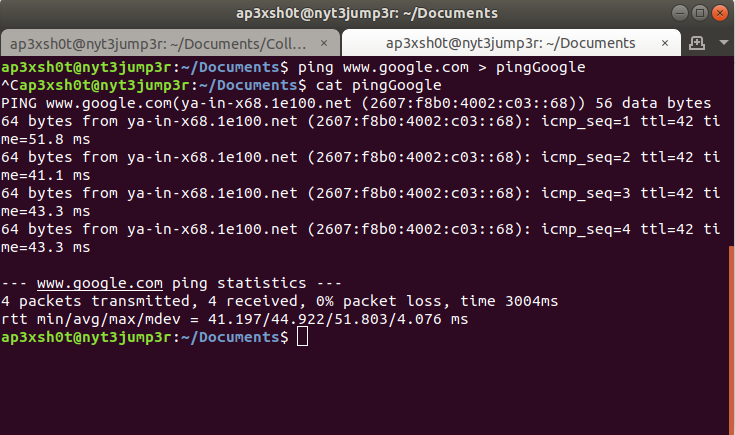

Section 4: Text Commands
=====

## Content

### [Subsection 0: Text](#text)
> Brief description of the system commands
### [Subsection 1: Text Commands](#text-commands)
> List of all of the system commands in this guide
### [Subsection 2: Text Exercises](#text-exercises)
> Exercises to hone your skills

### Text
There are ways to filter and redirect text input and output to programs in Linux that might come in handy for your project. These commands are very powerful and allow for some really cool ways to slice data.

#### Text Commands

* [cat](#cat)					- Print contents of a file
* [Pipe Operator](#pipe-operator)		- Redirect output as input
* [Redirection Operator](#redirection-operator)	- Redirects output to a filestream
* [grep](#grep)					- Search text by pattern
* [cut](#cut)					- Cut text by a delimiter

#### cat
The cat utility is useful for printing the contents of a file. Sometimes a file will contain binary data which contains information that isn't human readable. You're still able to cat these files, but it will come out as jumbled garbage. The reason I bring this up is because while you're able to cat all files, many you really shouldn't need to.

#### Pipe Operator
The pipe operator "|" is very useful because it takes the output of some operation and uses it as the input for another operation. A good example of how the pipe operator works is below in the grep section.

#### Redirection Operator
The redirection operator ">" is useful for taking the output of an operation and write it to a file. Say you'd like to write a copy of a ping command. Ping is a network connectivity testing utility, but thats not important.

As you can see, the output generated by ping was redirected into a file that we can now print the contents out anytime we would like without having to rerun the utility.

#### grep
Grep is a very useful utility for searching large text outputs for specific patterns. Many times you may have too much output, which makes it difficult to find what you're looking for. Here is an example of using grep to eliminate unwanted output.

Imagine you are trying to find your IP address. Using iconfig to find our IP address looks like this:

As you can see ifconfig outputs a lot of undesirable information. If we pipe this output to grep and look for "192" we can eliminate all lines that doesn't contain this first octet of the IP address. It is important to note that "192" should be replaced with the first octet of the network you are on. Panthair issues IP addresses in the 169 range, so you should grep for 169.

#### cut
Sometimes you might grep for specific lines, but you want to write data to a file that excludes some information contained in that line. Lets use the ifconfig example to isolate our IP address and write it to a file.

First, we run the ifconfig utility and grep for "192"

> ifconfig | grep 192

Next, we figure out what delimiter we can cut by. If we use space, we can separate the different words in the line. Its worth noting that the output contains many spaces before the word "inet", so the field we want to select will not be what we originally think. The cut syntax goes like this:

> cut -d " " -f n; where " " is a delimiter of space and n is the field number

As it turns out, if we pipe the output of our grep to cut using a delimiter of space, the field we need to look at to isolate our IP address is field 10. The command looks like this:

> ifconfig | grep 192 | cut -d " " -f 10

Now, if we want to write the IP address to a file, we can use the redirection operator to a file.

> ifconfig | grep 192 | cut -d " " -f 10

### Text Exercises
* Edit the script in your home directory to print another line
	* The script should look like:
	> #!/usr/bin/python
	> print "It's not an option"
	> print "NASA Robotics is awesome!"
	* Run the script to make sure it works
* Now run the script, but use pipe and grep to print only the line that contains "NASA"
* Next, use cut to islate the word "NASA"
* Redirect the output to a file called "NASA.training"
* Print the contents of "NASA.training" to the screen

### What you should have learned:

* ***How to print the contents of a file***
* ***How to redirect output***
* ***How to isolate information in large outputs***

