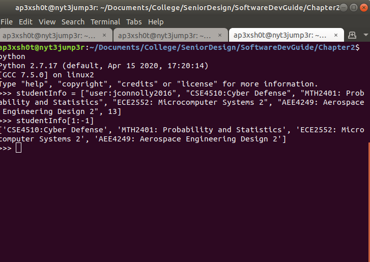

Section 2: Lists and Tuples
=====

## Content

### [Subsection 0: Lists](#lists)
> Lists and list methods
### [Subsection 1: Tuples](#tuples)
> Tuples and tuple methods
### [Subsection 2: Exercises](#exercises)
> Exercises to hone your skills

### Lists

A list is very similar to an array in C/C++. Much like an array, you can index values in the list using an integer. Take the example below:

> a = ["hello", "world"]

If we want to read index 0, we can see that the value would be "hello".

> print a[0]
>
> hello

One cool thing about lists in Python is the ability to have mixed data types. Take for example:

> a = [1, 3.14, "hello", 'B']

We can also change the elements of a list by index. This is called mutability. When a variable type is said to be mutable, it means the value inside of that variable can be changed.

> a[0] = "listsAreMutable"

##### Slicing

Python has the ability to slice lists to quickly limit the list to a subset of values. Say for instance you had a list of data that represented a student's coursework and you wanted to truncate the list and only want to see the courses the student is taking.



The slicing by index works this way: The first number "1" is where the slice starts, at index 1. The ":" states that we want to slice through until whatever the next number is. If we omit the number, it slices all the way to the end of the list. Interestingly enough, I used "-1" as the end number. That means from the end, take one index away.

As you can see, indexing is avery useful concept in Python.

#### List Methods

There are several very useful methods we can use with Python. Here are all of the important ones that I believe you should know:

##### len()

The len() function returns the length of the list of which it is invoked. 

> myList = ['a','b','c']<br>
> len(myList)
>
> 3

This is a very useful function because many times you will have a list of variable size and need to know how big the list is. For example:

```python
testScores = [96, 93, 88, 99]
testSum = 0

for score in testScores:
    testSum += score

print testSum / len(testScores)
```
In the example above we can see a practical use for needing to know the length of a list.

[Example Average Script](scripts/average.py)

##### append

Many times you'll need to add elements to a list. The way we can add elements is to use the append function.

> myList = []<br>
> myList.append("item")<br>
> print myList
> 
> ["item"]

#### Tuples

Tuples are very similar to lists, except they are immutable. This means the values of each index cannot be changed. *So why do I need to know about tuples if I can just use a list and  have more control?* Good question. The reason I bring this up is because when we get into socket level programming in the network section, you will have to deal with tuples. Its important to know that with tuples, you cannot change the values. Also, note that you can slice and index tuples JUST like lists. They're basically the same thing, except they can't be changed!

> myTuple = ("element 1","element 2","element 3")

#### Exercises

* Create a program that takes the following user inputs:
	* First name
	* Last name
	* Favorite ice cream flavor
* Place each of these strings into a tuple (because these will never change!)
* Try to change the value of one of the elements
* Now, change the script to input all strings into a list
* We really aren't interested in our name. Lets focus on whats REALLY important: the icecream
	* Slice and print just the icecream flavor from the list

[Solution](tuple.py)

#### What you should have learned:

* How to use lists.
* How to use tuples.
* How to slice both!


