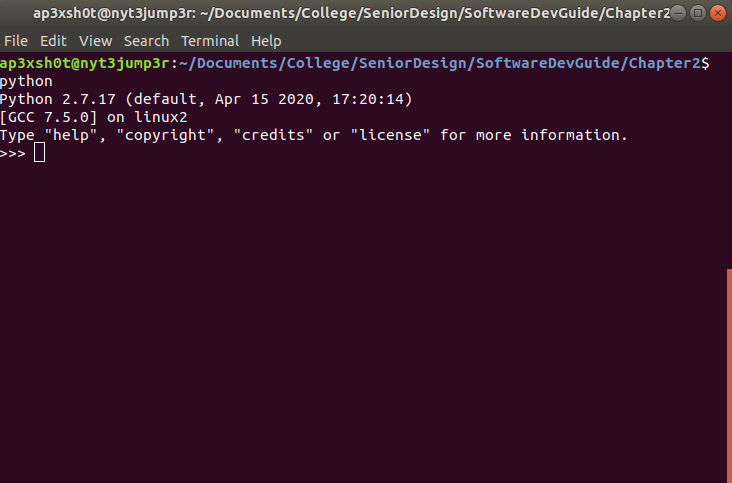

Chapter 1: Basic Python
=====

## Content

### [Section 0: Why Python?](#why-python)
> "But I already know matlab!"
### [Section 1: Variables](#variables)
> How to work with variables
### [Section 2: Lists and Tuples](LISTS.md)
> Pythonic arrays
### [Section 3: Strings](STRINGS.md)
> Way easier than c-srings!
### [Section 4: Dictionaries](DICTS.md)
> Key-value pairs
### [Section 5: Conditionals and Loops](LOOPS.md)
> If else and loops
### [Section 6: Functions](FUNC.md)
> How to abstract your code into modules
### [Section 7: Classes and Object Oriented Programming](CLASS.md)
> Creating classes and why
### [Section 8: Exceptions](TRYCATCH.md)
> How to gracefully handle failure
### [Section 9: Libraries](LIBRARIES.md)
> How in import and install libraries
-----

### Why Python?

I know, the last thing you need on your plate right now is to have to learn a new programming language. But hear me out! I have had zero formal training in Python. I have had nearly 3 years of C++ coursework, and I have developed in C extensively. I know Matlab quite well, too. I would STILL recommend Python for this application and here is why:

1. No memory management
	* There are no pointers in Python. You don't need to worry about writing into memory that you shouldn't.
2. Easy syntax
	* Python is much more readable than C++. For instance, compare these two examples:
	* C++ Example
	```c++
	#include <iostream>
	#include <cstring>

	int main()
	{
		char* name = "Joshua";
		for(int i = 0; i < strlen(name); i++)
		{
			std::cout << name[i] << std::endl;
		}
	}
	```
	* Python example
	```python
	name = "Joshua"

	for char in name:
    		print char
	```
	As you can see, the python code is much easier to read AND write.
	* [C++ Code Example](name.cpp)
	* [Python Code Example](name.py)
3. Extensive libraries
	* Python has libraries for everything. From working with databases, to networking...it even has a spotify library if you want to have your robot play your favorite tunes! Best part is there is a package installer called pip that makes installing most libraries a breeze. If you've ever tried to extend the functionality of C++ by adding libraries, you'll quickly realize Python does this a whole lot easier.
4. If you already know a language, learning Python is easy!
5. Its already installed in Linux! We don't have to even worry about installing it.

### Variables

Variables are a way to store values for use later. All of you at this point should be familiar with variables, so I won't bore you with the basics. The way that Python initializes variables is very simple.

> x = 0

This statement assigned x with the value of 0. No need to any type declaration. The best part is I can even do this with Python:

> x = 1
> x = "Cow"
> x = 3.14159

Notice how I've assigned varying types of data to the variable? Thats because the variable changes what the type is based on what value is assigned during initialization. Very cool! If you'd like to try this, you can open up the Python interpreter by typing "python" into a terminal.



From here, you can input commands and play with things all without having to commit to creating a script. Many times when I'm trying to rapidly test some small piece of code, I do so inside of the interpreter, and then when I know it works I transfer it to a script.

#### Variable Exercises

* Create a new script called "circumference.py"
* Create a variable named "pi" with the value of 3.14159
* Use the "raw_input" function to get input from the user
	* r = raw_input("Enter the radius of the circle: ")
* Calculate and print the circumference of the circle
	* C = 2*pi*r
* Run the script
	* python circumference.py

#### What you should have learned:

* How to use variables in Python
* How to get user input from the console
* How to print results to the console


